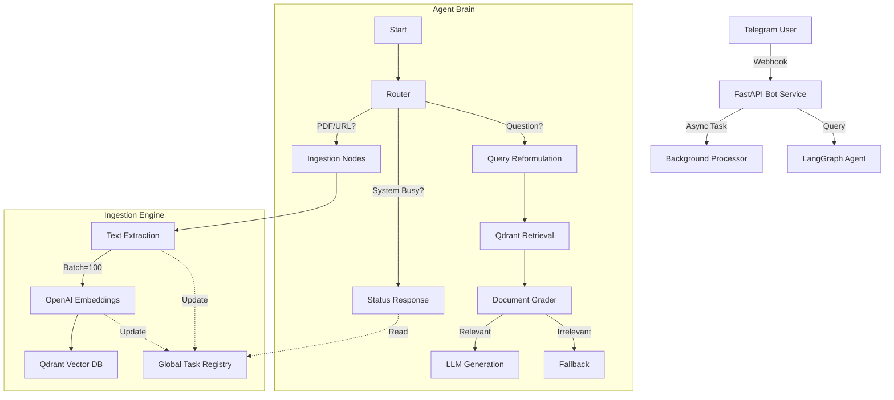

# Telegram Brain Agent: "Lord of Wisdom"

A highly advanced, self-aware RAG (Retrieval-Augmented Generation) Agent for Telegram, capable of processing PDFs, Voice Notes, and Images, while answering properly formatted mathematical queries.

## 🌟 Key Features

### 1. Multi-Modal Ingestion

- **PDF Documents**: Uploads standard PDFs, chunks them, and stores vector embeddings in Qdrant.
- **Voice Notes**: Uses **OpenAI Whisper** to transcribe audio messages into text before processing.
- **Images**: Uses **GPT-4o Vision** to analyze images (charts, equations) and ingest their textual description.
- **URLs**: Scrapes and ingests web content.

### 2. Intelligent Agent (LangGraph)

- **Reflective Search**: Rewrites queries to be optimized for vector search.
- **Self-Correction**: Uses a feedback loop (Grading) to ensure documents are relevant before generating an answer.
- **Short-Circuit Logic**: **Crucial feature**. If the system is busy (e.g., uploading a large book), the Agent "short-circuits" to avoid hallucinating answers based on old data. It strictly reports the current system status.

### 3. "X-Ray" Diagnostics & State Awareness

- **Global Registry**: A thread-safe internal registry tracks the exact status of background tasks (e.g., "Embedding Batch 5/50").
- **Real-Time Feedback**: Users can ask *"What are you doing?"* and get a precise technical sitrep, not a generic "Processing".

### 4. Advanced Rendering

- **LaTeX Support**: Automatically detects mathematical equations (e.g., `$$ E=mc^2 $$`) and renders them into high-resolution PNG images using `matplotlib`.

---

## 🏗️ Architecture



## 🛠️ Infrastructure & Configuration

### Prerequisites

- **Google Cloud Run**: For serverless hosting.
- **Qdrant**: Vector Database (Cloud or Local).
- **OpenAI API**: For Embeddings, Whisper, and Vision.
- **DeepSeek API**: For main Chat Generation (can be swapped for GPT-4).

### Environment Variables (.env)

```bash
TELEGRAM_BOT_TOKEN=...
OPENAI_API_KEY=...       # For Embeddings, Whisper, Vision
DEEPSEEK_API_KEY=...     # For Chat Logic
QDRANT_URL=...
QDRANT_API_KEY=...
QDRANT_COLLECTION_NAME=telegram_brain
```

### Docker Optimization

- **Base Image**: `python:3.11-slim`
- **System Deps**: `ffmpeg` (Audio), `libgl1` (Images), `fontconfig` (Fonts).
- **Matplotlib**: Configured with `Agg` backend for headless environments.

---

## 🚀 Deployment Guide

We use a custom PowerShell script `scripts/deploy.ps1` to handle the complexity of Cloud Run.

### 1. Login to GCloud

```powershell
gcloud auth login
gcloud config set project [YOUR_PROJECT_ID]
```

### 2. Run Deployment Script

```powershell
.\scripts\deploy.ps1
```

**What this script does:**

1. Loads variables from `.env`.
2. Builds the Docker Image in Google Cloud Build.
3. Deploys to Cloud Run with **CRITICAL FLAGS**:
   - `--memory 2Gi`: To prevent OOM crashes on large PDFs.
   - `--cpu 2`: For faster processing.
   - `--no-cpu-throttling`: **Essential**. Prevents CPU freeze during background ingestion.
4. Updates the Service with the Webhook URL automatically.

---

## 🔍 Troubleshooting

### "The document never uploads"

- **Cause**: CPU Throttling or Out of Memory (OOM).
- **Fix**: Ensure `--no-cpu-throttling` is checked and Memory is at least 2GiB. (Already fixed in `deploy.ps1`).

### "The bot hallucinates status"

- **Cause**: Bot confusion between RAG context and current status.
- **Fix**: The "Short-Circuit" logic in `graph.py` forces it to ignore RAG when `[SYSTEM_STATUS]` tag is active.

### "Equations look like code"

- **Cause**: Matplotlib failure.
- **Fix**: Check Dockerfile includes `fonts-dejavu` and `fontconfig`.
